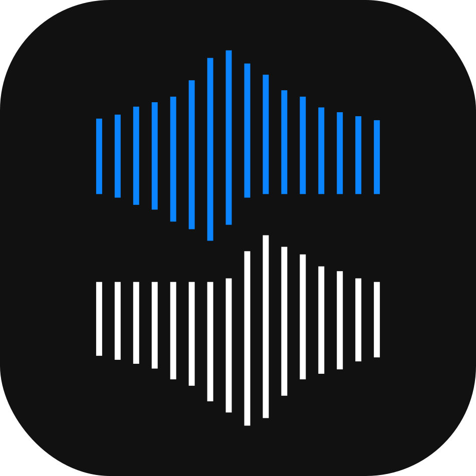

<div align="center">
  
  <br />
  <h1 style="display: inline-block; vertical-align: middle;">Silent Talk</h1>
  
  <p><strong>Real-Time Sign Language Translation & Accessibility Platform</strong></p>

  <p>
    
    
    
  </p>
  
  <p>
    <a href="https://youtu.be/MuX_m5dPpj4?si=ENCBESx-YJvemE78"><strong>▶️ Watch the Demo Video</strong></a>
  </p>
</div>

<br />

## 🏆 Project Highlights
**Silent Talk** was selected as a **Top 30 Semifinalist** (out of 300+ teams) in the **Samsung Solve for Tomorrow 2024** competition in Kazakhstan. 

* **Metric:** Trained on a custom dataset of **~50,000 images**, achieving **>90% accuracy** on validation samples during competition trials.
* **Impact:** Bridges the communication gap for the deaf and hard-of-hearing community by translating ASL gestures into text in real-time.

---

## 🏗️ System Architecture

This repository houses the **Proof of Concept (POC)** developed during the competition hackathon phase. It is structured as a monolithic prototype designed for rapid iteration.

### 1. The Vision Engine (Backend)
Located in `/backend`, the core logic is powered by **Python** and **OpenCV**.
* **Hand Tracking:** Utilizes MediaPipe for skeletal landmark extraction (21 points per hand).
* **Gesture Classification:** A trained **Scikit-Learn** classifier maps the 21-point vector geometry to ASL alphabets.
* **Speech Synthesis:** Converts recognized text streams into audio output for two-way communication.

### 2. The User Interface (Frontend)
Located in `/frontend`, the client is built with **React**.
* **Real-Time Feedback:** Visualizes the translation stream with low latency.
* **Accessibility First:** High-contrast UI designed for diverse user needs.

---

## 🛠️ Tech Stack

| Component | Technologies |
| :--- | :--- |
| **Core AI** | Python, OpenCV, MediaPipe, Scikit-Learn, NumPy |
| **Backend API** | Flask / Python (Prototype) |
| **Frontend** | React, JavaScript |
| **Deployment** | Localhost (POC Stage) |

---

## 🚀 Running the Prototype

> **Note:** This is a research prototype. Ensure you have Python 3.9+ and Node.js installed.

### Backend Setup
```bash
cd backend
python -m venv venv
source venv/bin/activate  # or venv\Scripts\activate on Windows
pip install -r requirements.txt
python app.py
```

### Frontend Setup

```bash
cd frontend
npm install
npm run dev
```

---

## ⚠️ Status & Disclaimer

This codebase represents the **competition snapshot** of Silent Talk. It was optimized for **speed of development** during the hackathon constraints.

* **Code Quality:** Experimental / Prototype Grade.
* **Maintenance:** Archived.

---

## 📬 Contact

**Alex Tkachyov** - Lead Developer

* **Connect:** [LinkedIn](https://linkedin.com/in/alexandr-tkachyov)

---

## 📄 License
This project is open for educational use under the [MIT License](LICENSE).